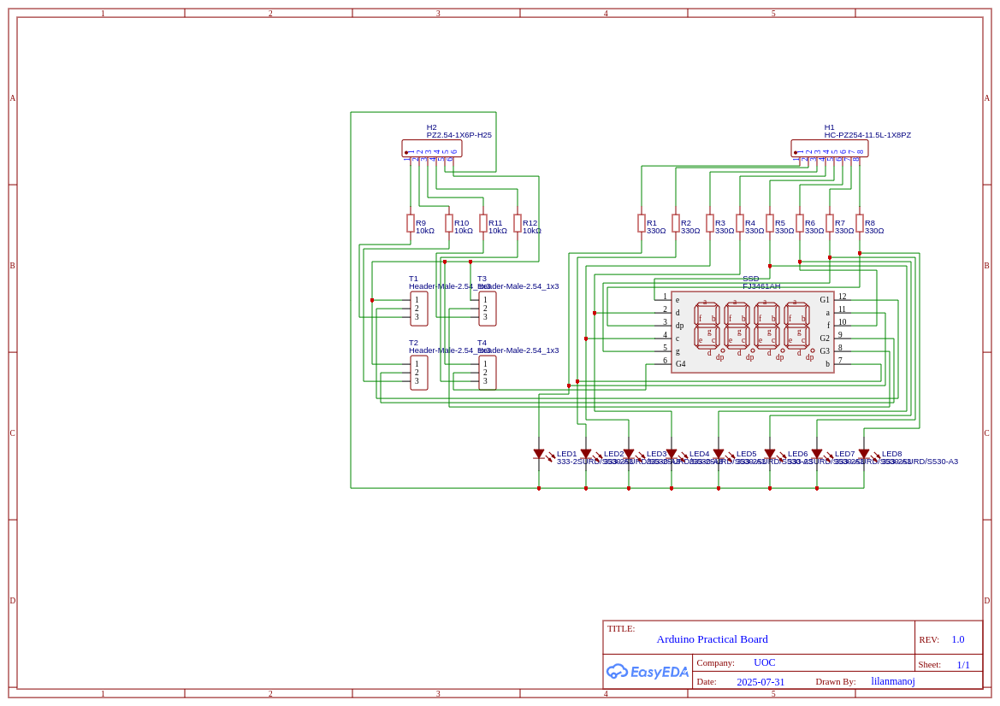
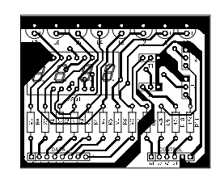

# This is a simple program to test the practical board

## Practical Board
### Schematic

### PCB merged layout

## Connetion help:
- Practical board pins counting from left to right
- Practical board data pins [0 - 5] => Arduino pins [2 - 7]
- Practical board data pins [6 - 7] => Arduino pins [14 - 15]
- Practical board control pins [0 - 3] => Arduino pins [19 - 16]
- Practical board control pins [4 - 5] => Arduino pins [12 - 13]